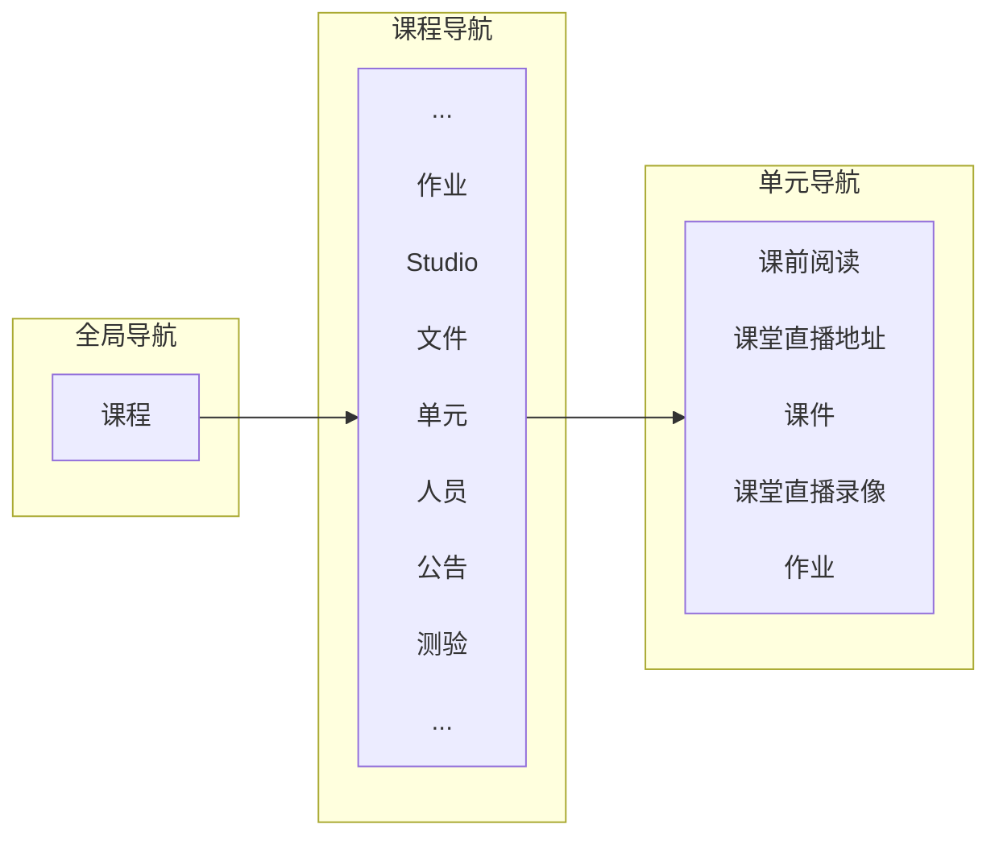

# 北大Canvas 简明教程

Updated 2007 GMT+8 May 30, 2022

2021/3/2 闫宏飞

**前言**

​		如标题所述，本教材关注于北京大学为开课教师和选课学生提供的Canvas学习管理平台（Learning Management System, LMS）。第一部分描述了课程进行中，使用Canvas设置课程网站，使用Teams进行课堂直播。第二部分描述了使用Canvas和Teams，进行期中或者期末考试。

​		北大Canvas网址，https://pku.instructure.com/

​		教师微信群：北大Canvas + Teams技术服务群（328）。加”guo-929“微信好友，邀请入群。

# 第一部分 授课中使用Canvas和Teams

##  第1章 引言

​		Canvas已经与北大教务系统对接，开课教师登录进入后，可以看到自己的课程，可以自行添加、删除选课学生和助教。

​		在电脑上使用，不需要安装，直接通过浏览器访问；在手机上使用，教师安装Canvas Teacher，学生安装Canvas Student。

​		Canvas中的课程内容是层级式展开，如图1所示，从选定一门**课程**开始，到课程内导航，到每周或者每次课程的**单元**导航。Canvas快速建课，就是进入课程、创建单元、上传文件、创建作业、和创建测验。课程单元可以是按周划分的单元，如“第一周”、“第二周”等，单元帮助您更好的安排和添加课程内容。

​		大家可以先观看Canvas一小时入门培训录像（主讲：沈倩宜 Dorin Shen，2020年2月8日），在“Growing with Canvas”课程中。

​														图1. Canvas中的课程内容层级式展开

​		教师或者助教可以在Canvas中，安排每周课程（在Canvas中称为单元），布置及批改作业，发布公告，和利用Studio的录屏工具制作微课件。

​		学生可以在Canvas中看到每周课程安排（如：课前预习资料、课件、课堂直播地址等），提交作业及查看教师反馈。

​		如图2所示，访问Canvas https://pku.instructure.com/ 。如图3所示，登录进入Canvas.

​														图2. 访问Canvas中

​															图3. 登录进入Canvas

## 第2章 课程设置

​		可参考：[如何使用 Canvas 设置课程](https://zh.guides.instructure.com/m/11077/l/1099124-canvas)

### 2.1 打开一门课程

​		请点击全局导航 (Global Navigation) 中的**课程 (Courses)** 链接 。然后点击您想查看的课程的名称。

​																		图4. 打开一门课程

​												图5. 进入单元设置

### 2.2 安排每周或者每次课程（单元）

​		课程单元可以是按周划分的单元，如“第一周”、“第二周”等，单元帮助您更好的安排和添加课程内容。

​							图6. a) 随着课程推进，单元内容呈现								b) 设置课程主页为课程单元

###  2.3 设置一个具体单元

​		单元可以增加、删除、移动。单元中包含的网页、作业，也可以增删改。

​																图7. 具体一个课程单元的设置

## 第3章 布置及批改作业

### 3.1 布置作业

​		布置作业，包括：编辑作业、作业组以及给作业赋予权重。作业组的意思是把作业、测验等分类，例如一门课可能有一次大论文，几次小讨论，小测验，虽然每次满分都是100，但在整门课所占的权重不同，所以设置作业组可以帮助老师们更好算分。

​		蓝色的链接里是操作视频，在观看视频的时候，可以点击右下角的“CC”选择字幕。详见：[Assignments](https://pku.instructure.com/courses/5/pages/3-dot-5-|-assignments-overview)

### 3.2 批改作业

​		当学生提交作业后可以使用Canvas的“快速评分器（speedgrader）”进行评分，详见：[SpeedGrader](https://pku.instructure.com/courses/5/pages/4-dot-4-|-welcome-to-speedgrader)

​		有作业需要批改的话，在右侧“待办事项”会有红点显示，可以利用零散时间，在电脑或手机端完成批注。

​															图8. 布置作业

​														图9. 点开一次作业

​														图10. 批改一份作业

​		==使用SpeedGrader经常问到的问题（Frequently Asked Questions, FAQ）==，如下所示。

Q: 作业要求提交多种类型多个文件（比如：作业要求提交文件类型py,ipynb和mp4），但是无法提交多个。如何解决？目前我是想到折中办法是先提交视频，其他py等文件作为附件，提交到评论中。

A: 理论上学生可以多次提交作业每次作业都会保留。

如果学生是从电脑上传文件的话，一次可以传多个；但如果提交Studio的话，您的方法确实是最合适的。

## 第4章 制作微课件

​		Studio是中最重要的，也是最有特色的！利用Studio，可以轻松录制微课、在视频里插入小测验、与学生就视频内容进行互动等。关于如何使用Studio，详见：[Studio使用指南](https://pku.instructure.com/courses/5/pages/studioshi-yong-zhi-nan)

### 4.1 使用Studio的录屏工具

​		利用Studio的录屏工具制作微课件制作步骤，是利用Canvas自带的 Studio ->记录->屏幕捕捉（Screen Capture）。 这样，本地机器如何操作，都录下来了，同时加声音解说，就形成了微课件。详见：[5分钟利用Studio的录屏工具制作微课件](https://pku.instructuremedia.com/embed/9cf7145a-abd9-4418-a5ff-5dcfed2e2f8f)

​		录好后，还有视频剪辑功能，没问题的话，点上传，就会存储在云端服务器。上传后，可以下载。

​		注意一次录制时间不要太长，免得上传时间过长。我通常不超过20分钟，如果内容较多，可以分段录制。微信群里面发视频，不能超过25MB。录制小的话，从云端下载回来，可以发到课程微信群。如果视频超过微信共享25MB的限制，可以在Studio中共享，把链接发在课程微信群里。

 

​														图11. 利用Studio的录屏工具制作微课件

​													图12：制作好的微课件

​		==使用Studio经常问到的问题==，如下所示。

Q: 请问剪辑用什么软件比较好？

Canvas中Studiso的Screen Capture自带视频编辑功能。 用这个自带的剪辑功能就可以，里面工具好多项。

如果只用了最简单的cut功能，就是剪掉开始或者结尾部分的杂乱画面，其他不动。

​							图13. Studio的Screen Capture视频编辑功能

Q: 字幕修改完了，保存了。然后还需要做什么吗？

publish按钮。

Q: 在canvas中看到的视频已经有字幕了，下载到本地的话，是不是字幕也跟过来了？我刚才下载了几次都没有字幕。

下载后，没有字幕。因为通常视频和字幕文件是分开的，需要播放软件支持同步。

需要另外下载字幕文件，就是：视频下载，字幕下载，然后播放时候，加载字幕文件。

Q: 字幕在屏幕上方，这个位置能改的吗？

播放器本身可以调节字幕位置，如果支持的话。

# 第二部分 考试时使用Canvas和Teams

## 第5章 在线考试方案

​		学期中教学需要使用Canvas教学管理平台结合Teams会议系统进行课堂直播，期中或者期末考试同样用Canvas出卷，Teams进行远程监考实现。

​		本章介绍利用北大Canvas+Teams实现在线考试组合方案。包括三部分内容：教师出题、学生身份验证暨考试诚信承诺书、学生在线考试和教师监考。

###  5.1 出考卷

​		教师出考卷，即组卷，利用Canvas中的“评分测验”实现。Canvas 有四种类型的测验，如图14所示。

​																			图14. Canvas四种类型测验

​	­	**评分测验**是最常见的测验。­练习测验用于了解用户在不评分的情况下对课程材料的掌握。评分调查为奖励学生完成调查而设，但不按答案的对错来评分。非评分调查为获取评论意见或其他信息而设。

​		出题流程包括两步：在题库中出题（准备问题）和利用题库中的问题组卷。

####  5.1.1 在题库中出题

​		题库出题，在Canvas中称为“ 管理题库”。点击 左侧菜单项 **测验**，点击 +测试 右侧 的 三个点 ，进入 **管理题库**，如图15所示。

​																		图15. Canvas出题页面入口

​	在题库中，可以增加书签（即放入不同的目录）来组织管理题库中包含的“问题”，如：“客观题-单选”放在一起、”客观题-多选”放在一起、”主观题-问答”放在一起等。如图16所示。

​																图16. 在题库中增加标签，问题分类放置备选

如果要添加问题，或者对现有问题进行编辑。首先进入相应书签目录，如图17所示。例如进入”客观题-单选“目录，可以“编辑已有题目”，如图18所示；或者“添加问题”，如图19所示。

​																图17. 添加或者编辑已有问题

​																	(a)																		(b)					

​											图18. 编辑已有问题，点击 (a) 问题类型下拉框，显示(b)，可以变更题目类型

​																	(a)																(b)					

​											图19. 添加问题，点击 (a) 问题类型下拉框，显示(b)，可以挑选题目类型

#### 5.1.2 出考卷

​	出考卷（组卷），在Canvas中是 “+测验”，即是带有问题的新测验。

​	在图2 “Canvas出题页面入口”中，点击 左侧菜单项 **测验**，点击 +**测试**：1）出现图20所示，给测验命名；2）设定好起止时间，如图21所示（与布置作业一样设置，只是考试的起止时间更短）。3）点击图20中蓝色标签“问题”，给测验添加问题（可以加“新问题”，或者从题库中“寻找问题”），如图22所示。4）组卷完成后，可以进行如图23所示的试卷预览。

​																图20. 出考卷（组卷）

​																		图21. 设定好起止时间

​															图22. 为测验加问题

​															图23. 试卷预览

### 5.2 身份验证暨考试诚信承诺书

​	 收集学生“身份验证暨考试诚信承诺书”的方法是：­教师在Cavans中**布置一次身份验证暨考试诚信承诺书作业**，要求学生“使用studio提交”完成作业。­学生利用Canvas的Studio录制mp4格式，完成该次作业。如图24所示。

­	身份验证视频包括：1）开始说明时间，自己的院系、姓名、学号。并在摄像头前展示，头像+手举学生证（或者学生卡）。2）朗读有“北京大学考试诚信承诺书”。并在摄像头前展示，头像+有签名和日期的承诺书。	

​	**注意**：优先选择学生证，如果没有学生证，用身份证/护照。承诺书推近摄像头，避免看不清楚。同时不要挡住脸。

​																图24. 身份验证暨考试诚信承诺书

可以要求学生签署《北京大学在线考试诚信承诺书》，如下给出。[^footnote1]

[^footnote1]: 教务部、教师教学发展中心，2020年3月7日发布的《北京大学在线考试方式解决方法的建议》

----

​															**北京大学考试诚信承诺书**

 

​		我承诺，在考试期间，不使用、提供或接受未经授权的任何帮助或信息，不请人代考或者代替别人考试，按要求独立答卷，不与他人进行交流。

​		我承诺，严格遵守校规校纪，诚信考试！若有违反考试记录行为，同意按照《北京大学本科考试工作与学习纪律管理规定》处理。

 

​																													考生签名：       

​																																	年  			月  			日

----

学生作业提交后，短视频在教师端自动就显示了。教师检查视频，每个视频平均不超过1分钟。如图25所示。

​											图25. 教师端看到学生提交的“身份验证暨考试诚信承诺书”短视频

### 5.3 学生在线考试和教师监考

#### 5.3.1 要求学生全程打开摄像头

​	在线考试，要求学生全程打开摄像头等方式开展[^footnote2]

[^footnote2]: 教务部，2020年4月7日发布的《关于2020年春季学期本科在线课程考核的原则意见

​	 学生准备侧机位，可以是手机或者pad放在支架上。如图26所示，根据教师提供会议链接，侧机位登入会议室。侧机位登入名称为“学生姓名+学号”，­侧机位打开摄像头、关闭音频。

​	考试期间，手机放远（如侧后方1.5米），拍摄全景。学生用电脑登录答题（例如：选择前面在Canvas中出好的考卷进行答题）。答题画面在监考范围内。摄像头对着计算机屏幕和学生本人，即让教师看到其计算机屏幕或动手操作。

​	**考试前，务必进行云监考环境测试。**才能确保考试期间，侧机位视角的清晰和有效性。
​	考试期间，摄像头不能关闭。

​																		图26. 学生端侧机位视角

#### 5.3.2 教师监考

​	考试期间，教师看到的画面如图27所示，即监考。

​															图27. 考试期间云监考

​		Teams监考技巧： 		

​		1）要最小化使用teams的功能，而不是使用teams提供的五花八门的功能，例如上课时候，老师和学生都关闭视频。因为微软产品性能低，并且很耗资源，例如2021年秋季学期，只要一开视频，声音就卡顿。

​		2）Teams有画廊模式和大型画廊模式。大型画廊适合云监考，因为画廊模式最多9个人画面。大型画廊最多7\*7\*2个画面，通过翻页看前后49个画面。传送过来的是云端合成后的一个画面，没办法操作某个人的画面，清晰度和网络有关，网络不稳定时为保证流畅，会自动降低分辨率。如果需要云监考更多学生，需要用不同teams账号，同时开多个会议，学生分组相应加入。

­		3）云端录像有问题。只能录9个画面。云监考时候，可以截屏；或者共享桌面，可以云录大型画廊模式的画面。

​		4）监考时候，大型画廊模式，抽查学生：可以点”三个点“，把某个学生”聚焦给所有人“，就可以看到该生放大后的图片。具体方式为：人员—学生姓名（搜索某位学生）—点该生旁边三个点”聚焦给所有人“，就可以看到该生的放大后的画面，且不影响大型画廊模式。

## 参考

[1]. Canvas中文指南，https://zh.guides.instructure.com/

[2]. Draw Diagrams With Markdown, https://support.typora.io/Draw-Diagrams-With-Markdown/

[3]. 沈倩宜 Dorin Shen，Canvas一小时入门培训录像.  在“Growing with Canvas”课程中，2020年2月8日.

## 附录. 课堂直播或云监考

​		课堂直播可以使用Teams，或者腾讯会议。上课时候，在教室中开启一个直播会议系统就可以，如附录图1所示。会议网址可以放在放在课程网站中或者直接发给学生。

​														附录图1. 课堂直播 

​		

​		使用Teams的步骤：1）如附录图2所示，打开Teams，点开左侧导航中的日历；2）如附录图3所示，在相应的日期和开始时间，鼠标左键单击，开始设置一次新会议；3）如附录图4所示，在收件箱中，复制会议链接，发送给参会者；4）如附录图5所示，学生通过Teams参加课堂直播，或者参加在线考试。

​											附录图2. 打开Teams，点开左侧导航中的日历

​										附录图3. 在相应的日期和开始时间，鼠标左键单击，开始设置一次新会议

​										附录图4. 在收件箱中，复制会议链接，发送给参会者

​										附录图5. 学生通过Teams参加课堂直播，或者参加在线考试

​		