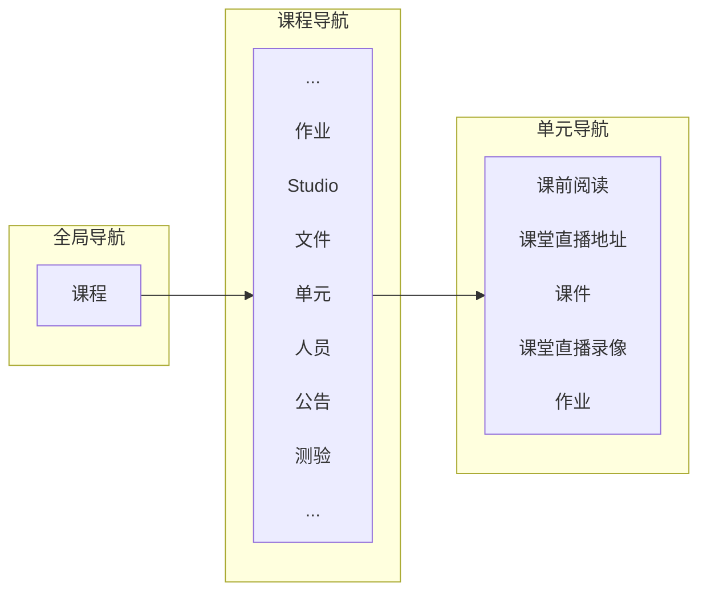

# 北大Canvas 简明教程

2021/3/2 闫宏飞

北大Canvas网址，https://pku.instructure.com/

教师微信群：北大Canvas + Teams技术服务群（328）。加”guo-929“微信好友，邀请入群。

##  介绍

​		Canvas是北京大学为开课教师和选课学生提供的学习管理平台（Learning Management System, LMS）。Canvas已经与北大教务系统对接，开课教师登录进入后，可以看到自己的课程，可以自行添加、删除选课学生和助教。

​		在电脑上使用，不需要安装，直接通过浏览器访问；在手机上使用，教师安装Canvas Teacher，学生安装Canvas Student。

​		Canvas中的课程内容是层级式展开，如图1所示，从选定一门**课程**开始，到课程内导航，到每周或者每次课程的**单元**导航。Canvas快速建课，就是进入课程、创建单元、上传文件、创建作业、和创建测验。课程单元可以是按周划分的单元，如“第一周”、“第二周”等，单元帮助您更好的安排和添加课程内容。

​		大家可以先观看Canvas一小时入门培训录像（主讲：沈倩宜 Dorin Shen，2020年2月8日），在“Growing with Canvas”课程中。

​														图1. Canvas中的课程内容层级式展开

​		教师或者助教可以在Canvas中，安排每周课程（在Canvas中称为单元），布置及批改作业，发布公告，和利用Studio的录屏工具制作微课件。

​		学生可以在Canvas中看到每周课程安排（如：课前预习资料、课件、课堂直播地址等），提交作业及查看教师反馈。

​		如图2所示，访问Canvas https://pku.instructure.com/ 。如图3所示，登录进入Canvas.

​														图2. 访问Canvas中

​															图3. 登录进入Canvas

## 课程设置

​		可参考：如何使用 Canvas 设置课程，https://zh.guides.instructure.com/m/11077/l/1099124-canvas

### 2.1 打开一门课程

​		请点击全局导航 (Global Navigation) 中的**课程 (Courses)** 链接 。然后点击您想查看的课程的名称。

​																图4. 打开一门课程

​											图5. 进入单元设置

### 2.2 安排每周或者每次课程（单元设置）

​		课程单元可以是按周划分的单元，如“第一周”、“第二周”等，单元帮助您更好的安排和添加课程内容。

​				图6. a) 随着课程推进，单元内容呈现								b) 设置课程主页为课程单元

###  2.3 针对一个具体单元的设置

​		单元可以增加、删除、移动。单元中包含的网页、作业，也可以增删改。

​															图7. 具体一个课程单元的设置

## 布置及批改作业

### 3.1 布置作业

​		布置作业，包括：编辑作业、作业组以及给作业赋予权重。作业组的意思是把作业、测验等分类，例如一门课可能有一次大论文，几次小讨论，小测验，虽然每次满分都是100，但在整门课所占的权重不同，所以设置作业组可以帮助老师们更好算分。

​		蓝色的链接里是操作视频，在观看视频的时候，可以点击右下角的“CC”选择字幕。详见：[Assignments](https://pku.instructure.com/courses/5/pages/3-dot-5-|-assignments-overview)

### 3.2 批改作业

​		当学生提交作业后可以使用Canvas的“快速评分器（speedgrader）”进行评分，详见：[SpeedGrader](https://pku.instructure.com/courses/5/pages/4-dot-4-|-welcome-to-speedgrader)

​		有作业需要批改的话，在右侧“待办事项”会有红点显示，可以利用零散时间，在电脑或手机端完成批注。

​														图8. 布置作业

​												图9. 点开一次作业

​											图10. 批改一份作业

==使用SpeedGrader经常问到的问题（Frequently Asked Questions, FAQ）==，如下所示。

Q: 作业要求提交多种类型多个文件（比如：作业要求提交文件类型py,ipynb和mp4），但是无法提交多个。如何解决？目前我是想到折中办法是先提交视频，其他py等文件作为附件，提交到评论中。

A: 理论上学生可以多次提交作业每次作业都会保留。

如果学生是从电脑上传文件的话，一次可以传多个；但如果提交Studio的话，您的方法确实是最合适的。

## 制作微课件

Studio是中最重要的，也是最有特色的！利用Studio，可以轻松录制微课、在视频里插入小测验、与学生就视频内容进行互动等。关于如何使用Studio，详见：[Studio使用指南](https://pku.instructure.com/courses/5/pages/studioshi-yong-zhi-nan)

### 4.1 利用Studio的录屏工具制作微课件

​		利用Studio的录屏工具制作微课件制作步骤，是利用Canvas自带的 Studio ->记录->屏幕捕捉（Screen Capture）。 这样，本地机器如何操作，都录下来了，同时加声音解说，就形成了微课件。详见：[5分钟利用Studio的录屏工具制作微课件](https://pku.instructuremedia.com/embed/9cf7145a-abd9-4418-a5ff-5dcfed2e2f8f)

​		录好后，还有视频剪辑功能，没问题的话，点上传，就会存储在云端服务器。上传后，可以下载。

​		注意一次录制时间不要太长，免得上传时间过长。我通常不超过20分钟，如果内容较多，可以分段录制。微信群里面发视频，不能超过25MB。录制小的话，从云端下载回来，可以发到课程微信群。如果视频超过微信共享25MB的限制，可以在Studio中共享，把链接发在课程微信群里。

 

​								图11. 利用Studio的录屏工具制作微课件

​						图12：制作好的微课件

==使用Studio经常问到的问题==，如下所示。

Q: 请问剪辑用什么软件比较好？

Canvas中Studiso的Screen Capture自带视频编辑功能。 用这个自带的剪辑功能就可以，里面工具好多项。

我只用了最简单的cut功能，就是剪掉开始或者结尾部分的杂乱画面，其他不动。

​					图13. Studio的Screen Capture视频编辑功能

Q: 字幕修改完了，保存了。然后还需要做什么吗？

publish按钮。

Q: 在canvas中看到的视频已经有字幕了，下载到本地的话，是不是字幕也跟过来了？我刚才下载了几次都没有字幕。

下载后，没有字幕。因为通常视频和字幕文件是分开的，需要播放软件支持同步。

需要另外下载字幕文件，就是：视频下载，字幕下载，然后播放时候，加载字幕文件。

Q: 字幕在屏幕上方，这个位置能改的吗？

播放器本身可以调节字幕位置，如果支持的话。

## 参考

[1]. Canvas中文指南，https://zh.guides.instructure.com/

[2]. Draw Diagrams With Markdown, https://support.typora.io/Draw-Diagrams-With-Markdown/

[3]. 沈倩宜 Dorin Shen，Canvas一小时入门培训录像.  在“Growing with Canvas”课程中，2020年2月8日.

## 附录1. 课堂直播或云监考

课堂直播可以使用Teams，或者腾讯会议。上课时候，在教室中开启一个直播会议系统就可以，会议网址可以放在放在课程网站中。

​										图14. 课堂直播 

使用Teams的步骤：

​											图15. 打开Teams，点开左侧导航中的日历

​											图16. 在相应的日期和开始时间，鼠标左键单击，开始设置一次新会议

​											图17. 在收件箱中，复制会议链接，发送给参会者

​											图18. 学生通过Teams参加课堂直播，或者参加在线考试

​		Teams有大型画廊模式了,刚好可以云监考。但是目前没有翻页功能，可以显示49人最多。如果需要云监考更多考生，需要用不同teams账号，同时开多个会议，学生分组相应加入。

­		另外，1）云端录像有问题。只能录9个画面，尽管当时能看到更多的画面。只能云监考时候，截屏。2）­“大型画廊模式”，太消耗资源（容易死机），因为画面一多，机器风扇就很响了。­网络也出现多次断连，估计是“大型画廊画廊模式”没有优化。